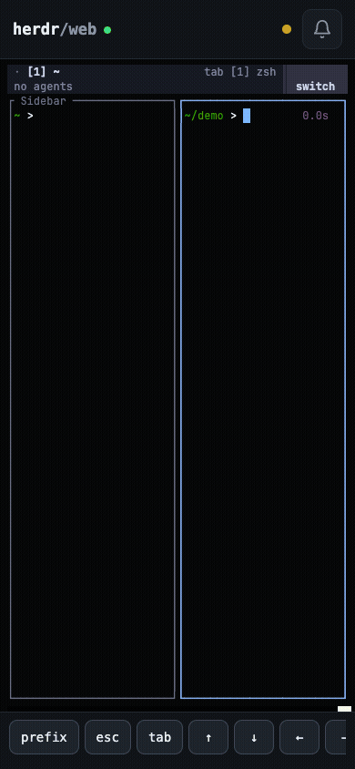
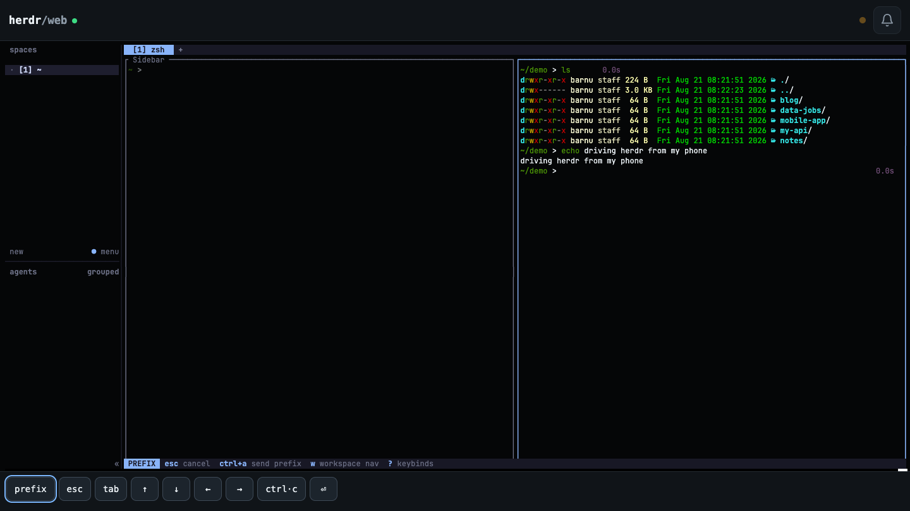

# herdr-web

The full [herdr](https://herdr.dev) TUI in your browser — a web terminal (xterm.js over a
server-side PTY) that runs the real `herdr` client, so everything works exactly like your
terminal: tabs, panes, the sidebar, prefix keys, mouse — from a phone or any desktop browser.
On top of it: **Web Push notifications** when an agent finishes or gets stuck, delivered by
Chrome/Edge even when the page is closed.

<p align="center"></p>



## Features

- **The real herdr TUI** — not a re-implementation: the server spawns `herdr` in a PTY per
  browser tab and streams it to xterm.js. Native typing, full keyboard, resize-aware reflow.
- **Web Push notifications** — toggle the bell: the server keeps VAPID keys and your push
  subscription, and when an agent transitions out of `working` or into `blocked`, the browser's
  push service (FCM for Chrome/Edge) delivers a **system notification on desktop and mobile,
  even with the page closed**. In-app toasts mirror every event while the page is open.
- **Agent herd strip** — the top bar shows one status dot per agent pane (amber = working,
  green = idle, red = blocked), fed by a CLI topology poller independent of the terminal stream.
- **Quick-keys bar** — `prefix` (ctrl+a), `esc`, `tab`, arrows, `ctrl+c`, `enter` for keys phone
  keyboards lack.
- **Installable PWA** with Nerd Font glyphs bundled (Symbols Nerd Font Mono, MIT), so the TUI's
  icons render on any device.

## Architecture

```
        herdr TUI (one PTY per browser tab, node-pty)          herdr CLI
        ▲ │ raw terminal bytes                                 ▲ pane list (agent states)
        │ ▼                                                    │
   server.js ── WebSocket /ws (input/resize/output JSON) ── state-watcher ── web-push (VAPID)
        │  HTTP: static public/ + /push/* endpoints                              │
        ▼                                                                        ▼
   React + xterm.js client (client/ → built into public/, committed)   Chrome/Edge push service
```

The production client build is **committed to git**, so installing the plugin never needs a
frontend build — the manifest's `[[build]]` step installs the server's runtime deps (`ws`,
`node-pty`, `web-push`; node-pty uses prebuilt binaries, and a postinstall step restores the
exec bit npm strips from its spawn helper).

## Install

From GitHub:

```bash
herdr plugin install barnuri/herdr-web
```

Or from a local clone (linked in place — edits take effect without reinstalling):

```bash
git clone https://github.com/barnuri/herdr-web
cd herdr-web
npm install --omit=dev   # the [[build]] step herdr runs on a GitHub install
herdr plugin link .
```

The startup hook launches the server when herdr starts. Open it with the
`Open Herdr Web in browser` action, or visit `http://127.0.0.1:7936`.

## Configuration

`config.json` in the plugin config dir (`herdr plugin config-dir barnuri.herdr-web`). Create it
in one line:

```bash
echo '{ "port": 7936 }' > "$(herdr plugin config-dir barnuri.herdr-web)/config.json"
```

All keys (every one optional):

```json
{
    "host": "127.0.0.1",
    "port": 7936,
    "topologyPollMs": 2000,
    "allowedOrigins": [],
    "herdrArgs": []
}
```

`HERDR_WEB_HOST` / `HERDR_WEB_PORT` env vars override the file. `herdrArgs` is passed to the
spawned `herdr` TUI (e.g. `["--session", "web"]` to attach browsers to a separate named session).

## Phone access & notifications

The server binds to `127.0.0.1` by default and has **no authentication** — do not bind it to a
public interface. WebSocket upgrades from browser pages are rejected unless the page's `Origin`
matches the request host or is listed in `allowedOrigins` in `config.json` (add your proxy's
origin, e.g. `"allowedOrigins": ["https://machine.tailnet.ts.net"]`, if the proxy forwards a
different Host). Note this is same-origin enforcement, not authentication — a DNS-rebinding
attacker who controls both headers can still pass it, so keep the bind local and the proxy
authenticated. To use it from a phone:

- **Tailscale (recommended):** `tailscale serve 7936` gives you an HTTPS URL on your tailnet.
  HTTPS (or localhost) is required for service workers, PWA install, and the Notification API
  on mobile.
- Any other authenticated HTTPS reverse proxy works the same way.

Notifications are real **Web Push**: the bell subscribes through the browser's push service and
the plugin's server (which generates and stores its VAPID keys in the plugin state dir) pushes
agent events to it — so Chrome/Edge show system notifications on desktop and Android even when
the page is closed. Push requires a secure context: HTTPS (Tailscale) or localhost. If the
browser has the permission blocked, the bell copies your browser's notification-settings address
to the clipboard so you can unblock the site. Where push is unavailable, the bell falls back to
page-side notifications while the app is open.

## Development

One helper script per platform, same four subcommands (`setup` · `dev` · `test` · `build`,
default `dev`; deps install automatically on first run):

macOS / Linux:

```bash
scripts/dev.sh          # server on :7936 + vite dev on :5173 (ws-proxied)
scripts/dev.sh test     # server (node --test) + client (vitest) suites
scripts/dev.sh build    # rebuild public/ from client/ (commit the result)
```

Windows (PowerShell):

```powershell
scripts/dev.ps1         # same as above
scripts/dev.ps1 test
scripts/dev.ps1 build
```

## Publishing note

The herdr marketplace indexes public GitHub repos carrying the `herdr-plugin` topic — add that
topic to the repo to make the plugin discoverable.

## License

MIT
